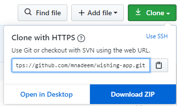
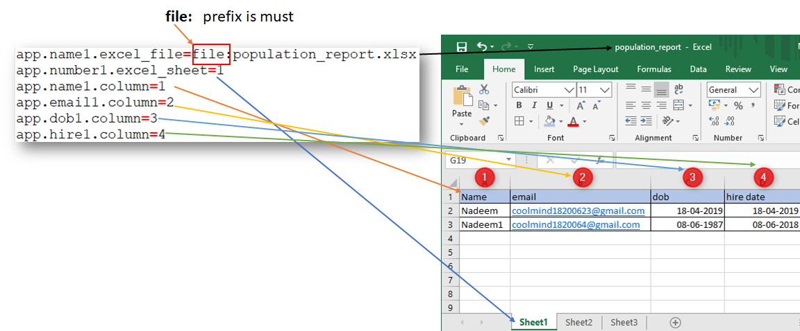
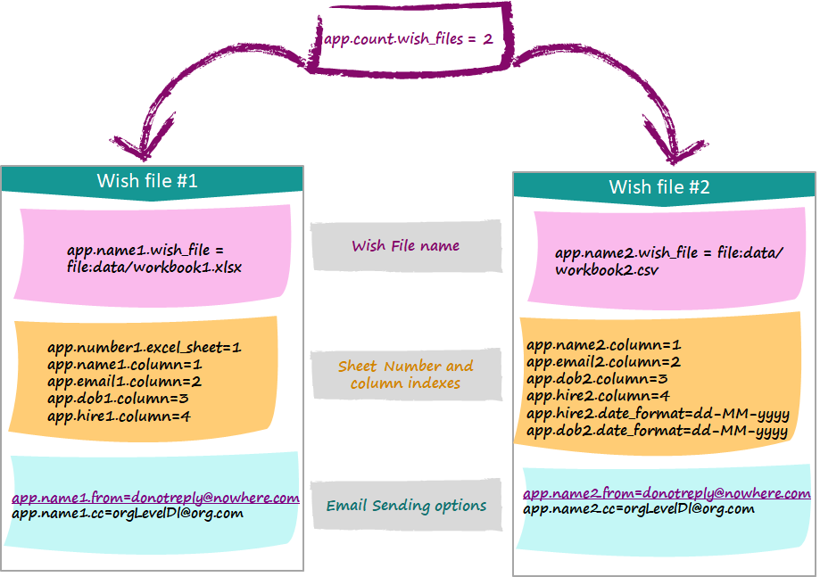

# Wishing Application
Application to send birthday and anniversary wish emails elegantly.

## Why

1. Does it job (Sending Birthday and anniversary email wishes) very elegantly
2. Highly Configurable : Load multiple workbooks, specify columns to load, different email details (from, cc) for each workbook, supports multiple LOBs within org
3. Randomly choose images from different buckets (birthday and anniversary, anniversary duration)
4. Support multiple SMTP servers: Gmail, hotmail, yahoo even corporate
5. Run anywhere in local and in cloud, as docker container or as plain application
6. Low footprint does not require database, S3, Nas storage or Web server
7. Good Coding practices have been followed to allow for extension easily
8. Robust documentation to kick started easily
9. Download Configure and Run
10. Customize When the job runs
11. Different ways of loading workbook
12. Only open-source application in this area

# Prerequisites
* Java 8
* Maven 3
* Docker if you are deploying this app to Docker
* Excel Reports with **name**, **email**, **dob** and **hire date** columns

# Getting Started

#### Step 1 : Clone and Download the project



#### Step 2 : Extract into a location

#### Step 3 : Configure

Basically you have to update `src/main/resources/applicaion.properties` file for the following details

* When the job should run and how frequent, default is 10:00 AM daily `app.schedule.corn` (We should run only once every day otherwise there are chances to miss mailer, or send multiple times)
* Weather birthday (`app.mailer.birthday.enabled`) or anniversary (`app.mailer.anniversary.enabled`) or both mailer should be disabled?
* Number of excel files to load (`app.count.excel_files`) default is one.
* Configuration of each excel file : Excel file name (`app.name1.excel_file`), Sheet number (`app.number1.excel_sheet`), Email column index (`app.email1.column`), Dob column index (`app.dob1.column`), hire date column index (`app.hire1.column`) name column index (`app.name1.column`), from (`app.name1.from`) and cc (`app.name1.cc`) details. If you have more number of excel files to load you have to specify for each one, by incrementing the number
* Excel files should be kept under `src/main/resources/data/` 
* Birthday image details : Birth images should reside under `src/main/resources/data/images/birthday` , add more images if required incrementally (There should not be a gap), naming should be 1.png, 2.png, 3.png, 5.png and so on. key `app.birthday.image_count` should reflect how many images are there, randomly images would be picked while sending wish. Refer to configuration section below for more details
* Anniversary image details : Anniversary images should reside under `src/main/resources/data/images/anniversary` , add more images if required. There are sub folders 1 (one year), 2 (Two years), 3 (Three years) and so on, further there is default folder which is kind of catch all. All these folders should contain images named incrementally (There should not be any gap), 1.png, 2.png, 3.png and so on. `app.anniversary.years_count` controls how many anniversary image folders are provided default is 5. First year anniversary image count is controlled by `app.anniversary.year1.image_coun`, second year anniversary image count is controlled by `app.anniversary.year2.image_coun` similarly third year anniversary image count is controlled by `app.anniversary.year3.image_coun` and so on. Catch all folder image count is controlled by `app.anniversary.default.image_count`. Refer to configuration section below for more details
* SMTP detail : Default have been provided for gmail
* Email related keys : `app.name<index>.from` and `app.name<index>.cc` from and cc of email for worksheet `<index>`

#### Step 4 : Run the project
Look at Running section below for more details.


# Loading Workbooks

Excel files to load should be kept under `src/main/resources/data/` as discussed above, there are couple of keys which drive the loading part:

Excel file level keys

* `app.count.excel_files` : Number of excel files to load
* `app.name<index>.excel_file` : Name of the excel file at `<index>`
* `app.number<index>.excel_sheet` : Excel sheet number in the given workbook at `<index>`

Column level keys in a given sheet

* `app.name<index>.column` : Column index for **name** column (mandatory)
* `app.email<index>.column` : Column index for **email** column (mandatory) 
* `app.dob<index>.column` : Column  index for **dob** column, these cells should be **date and **not text** (at least one of dob or hire date column is required)
* `app.hire<index>.column` : Column index for hire date column, these cells should be **date** and **not text** (at least one of dob or hire date column is required)





**Note** : **Email** and **date** (Either dob or hire date) combination uniquely identify a wish.

## Various Options

1. We can load birthday report (name, email, dob) and anniversary (name, email, hire) report in separate excel files
2. We can load birthday report from sheet x and anniversary report from sheet y of same excel file
3. we can load an excel file having both birthday and anniversary data in same sheet (name, email, dob, hire).
4. We can load any combination of above.


# Configuration

There are **three** types of configurations

### Workbook Configuration
Look for an example in **application.properties**



### Image Configurations
Look for an example in **application.properties**


### SMTP Configurations
Look for an example in **application.properties**

```
spring.mail.default-encoding=UTF-8
spring.mail.host=smtp.gmail.com
spring.mail.username=YourEmail@gmail.com
spring.mail.password=GmailPAssword
spring.mail.port=587
spring.mail.protocol=smtp
spring.mail.test-connection=false
spring.mail.properties.mail.smtp.auth=true
spring.mail.properties.mail.smtp.starttls.enable=true
```


# Running

## Eclipse

Right click on ``com.github.nadeem.BootAppApplication`` ==> **Run as** ==> **Java Application**


## Spring Boot Command Line

```Powershell
mvn package spring-boot:run
```

## Docker

Build the image

```Powershell
mvn package docker:build
```
Image built

```Powershell
E:\githubRepos\wishing-app>docker images
REPOSITORY              TAG                  IMAGE ID            CREATED             SIZE
mnadeem/wishing-app     latest               c48f66bdb72c        31 seconds ago      148MB
openjdk                 8-jre-alpine         f7a292bbb70c        13 months ago       89.7MB
openjdk                 8-jdk-alpine         a3562aa0b991        13 months ago       110MB

E:\githubRepos\wishing-app>
```

No containers running yet.


```Powershell
E:\githubRepos\wishing-app>docker ps
CONTAINER ID        IMAGE               COMMAND             CREATED             STATUS              PORTS               NAMES


```
Start the container

```Powershell
E:\githubRepos\wishing-app>mvn docker:start
[INFO] Scanning for projects...
[INFO]
[INFO] -------------------< com.github.mnadeem:wishing-app >-------------------
[INFO] Building wishing-app 0.0.1-SNAPSHOT
[INFO] --------------------------------[ jar ]---------------------------------
[INFO]
[INFO] --- docker-maven-plugin:0.33.0:start (default-cli) @ wishing-app ---
[INFO] DOCKER> [docker.io/mnadeem/wishing-app:latest]: Start container 98651db65ded
[INFO] ------------------------------------------------------------------------
[INFO] BUILD SUCCESS
[INFO] ------------------------------------------------------------------------
[INFO] Total time:  1.554 s
[INFO] Finished at: 2020-06-05T08:43:09+05:30
[INFO] ------------------------------------------------------------------------

E:\githubRepos\wishing-app>

```

Container started


```Powershell
E:\githubRepos\wishing-app>docker ps
CONTAINER ID        IMAGE                 COMMAND                  CREATED             STATUS              PORTS               NAMES
98651db65ded        mnadeem/wishing-app   "java -jar wishing-a…"   29 seconds ago      Up 28 seconds                           wishing-app-1

E:\githubRepos\wishing-app>

```

View logs 

```Powershell
E:\githubRepos\wishing-app>docker logs 98651db65ded

  .   ____          _            __ _ _
 /\\ / ___'_ __ _ _(_)_ __  __ _ \ \ \ \
( ( )\___ | '_ | '_| | '_ \/ _` | \ \ \ \
 \\/  ___)| |_)| | | | | || (_| |  ) ) ) )
  '  |____| .__|_| |_|_| |_\__, | / / / /
 =========|_|==============|___/=/_/_/_/
 :: Spring Boot ::        (v2.3.0.RELEASE)

2020-06-05 03:13:11.239  INFO 1 --- [           main] c.g.mnadeem.wishing.WishingApplication   : Starting WishingApplication v0.0.1-SNAPSHOT with PID 1 (/app/wishing-app.jar started by root in /app)
2020-06-05 03:13:11.242  INFO 1 --- [           main] c.g.mnadeem.wishing.WishingApplication   : No active profile set, falling back to default profiles: default
2020-06-05 03:13:12.368  INFO 1 --- [           main] o.s.s.c.ThreadPoolTaskScheduler          : Initializing ExecutorService 'taskScheduler'
2020-06-05 03:13:12.383  INFO 1 --- [           main] c.g.mnadeem.wishing.WishingApplication   : Started WishingApplication in 2.021 seconds (JVM running for 2.564)
2020-06-05 03:13:17.888 ERROR 1 --- [   scheduling-1] o.s.s.s.TaskUtils$LoggingErrorHandler    : Unexpected error occurred in scheduled task


```

Stop the container

```Powershell
E:\githubRepos\wishing-app>mvn docker:stop
[INFO] Scanning for projects...
[INFO]
[INFO] -------------------< com.github.mnadeem:wishing-app >-------------------
[INFO] Building wishing-app 0.0.1-SNAPSHOT
[INFO] --------------------------------[ jar ]---------------------------------
[INFO]
[INFO] --- docker-maven-plugin:0.33.0:stop (default-cli) @ wishing-app ---
[INFO] DOCKER> [docker.io/mnadeem/wishing-app:latest]: Stop and removed container 98651db65ded after 0 ms
[INFO] ------------------------------------------------------------------------
[INFO] BUILD SUCCESS
[INFO] ------------------------------------------------------------------------
[INFO] Total time:  05:01 min
[INFO] Finished at: 2020-06-05T08:51:44+05:30
[INFO] ------------------------------------------------------------------------

```

Refer [fabric8 home](http://dmp.fabric8.io/) for details on commands

# Support
If you need help feel free to drop an email or create an issue in github.com (preferred)

# Contributions

You are encouraged to 

* Provide suggestion/feedback/Issue
* Pull requests for new features
* Star :star2: the project
